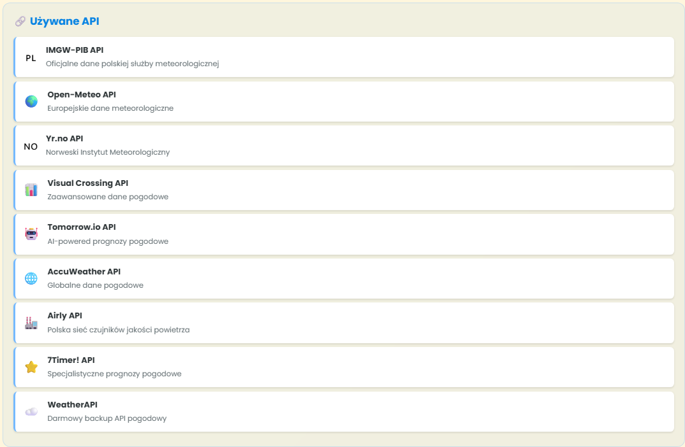
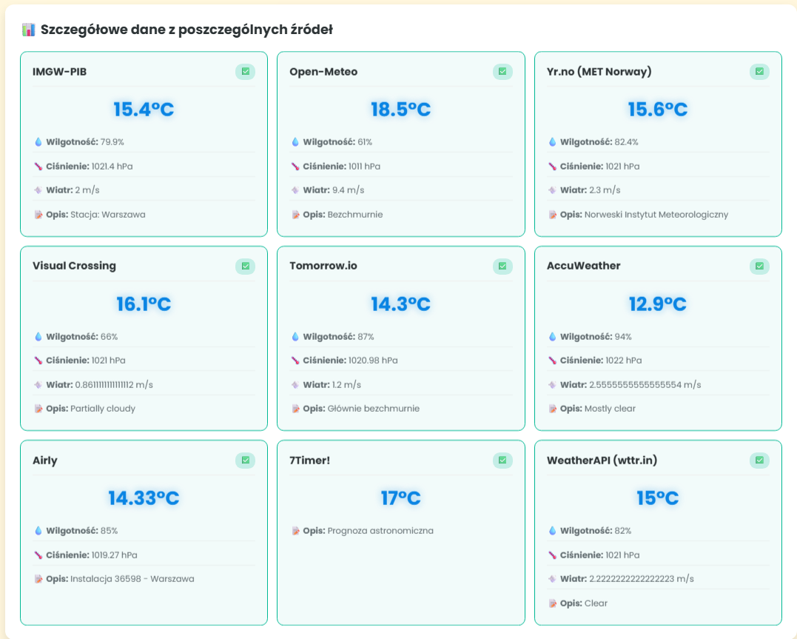
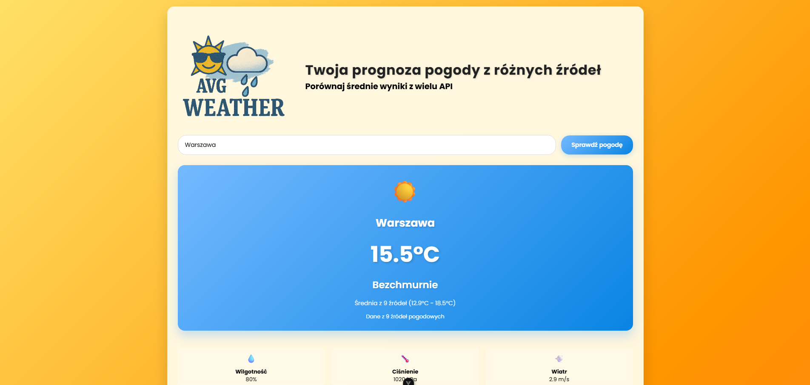

# 🌤️ AVG Weather - Aplikacja Pogodowa

## 📋 Opis projektu

AVG Weather to nowoczesna aplikacja pogodowa, która pobiera dane z **9 różnych API pogodowych** i oblicza średnią temperaturę dla maksymalnej dokładności. Aplikacja została stworzona w Vue.js z wykorzystaniem najnowszych technologii frontendowych.

## ✨ Funkcje

- 🌡️ **Średnia temperatura** z 9 źródeł API
- 📊 **Szczegółowe dane** z każdego API osobno
- 📈 **Statystyki pogodowe** (min/max/średnia)
- 🎨 **Dynamiczne tła** zmieniające się według pogody
- 📱 **Responsywny design** dla wszystkich urządzeń
- ⚡ **Lazy loading** komponentów dla lepszej wydajności
- 🇵🇱 **Obsługa polskich miast**

## 🔗 Używane API

Aplikacja korzysta z następujących źródeł danych:

- **IMGW-PIB API** - Oficjalne dane polskiej służby meteorologicznej
- **Open-Meteo API** - Europejskie dane meteorologiczne
- **Yr.no API** - Norweski Instytut Meteorologiczny
- **Visual Crossing API** - Zaawansowane dane pogodowe
- **Tomorrow.io API** - AI-powered prognozy pogodowe
- **AccuWeather API** - Globalne dane pogodowe
- **Airly API** - Polska sieć czujników jakości powietrza
- **7Timer! API** - Specjalistyczne prognozy pogodowe
- **WeatherAPI** - Darmowy backup API pogodowy

## 🚀 Demo

**Aplikacja dostępna online:** [https://budziun.github.io/avg-weather/](https://budziun.github.io/avg-weather/)

## 📱 Jak używać

1. **Wpisz nazwę miasta** w Polsce (np. Warszawa, Kraków, Olsztyn)
2. **Kliknij "Sprawdź pogodę"** lub naciśnij Enter
3. **Poczekaj** na pobranie danych z 9 źródeł
4. **Sprawdź wyniki:**
   - Główną kartę z średnią temperaturą
   - Szczegółowe dane z każdego API
   - Statystyki pogodowe
   - Informacje o używanych źródłach

## 🌐 Najlepsza wydajność

Dla **najlepszej responsywności i płynności** aplikacji zalecamy używanie przeglądarek:
- **Microsoft Edge** ⭐ (zalecane)
- **Opera** ⭐ (zalecane)
- Chrome (może być wolniejszy)
- Firefox
- Safari

## 🛠️ Technologie

- **Vue.js 3** - Framework JavaScript
- **Vite** - Build tool
- **Composition API** - Nowoczesny Vue.js
- **CSS3** - Animacje i responsive design
- **GitHub Pages** - Hosting
- **9 Weather APIs** - Źródła danych

## 📊 Funkcje techniczne

- **Lazy loading** komponentów dla lepszej wydajności
- **Intersection Observer** dla płynnego renderowania
- **Debounced search** dla optymalizacji
- **Error handling** dla każdego API
- **Responsive grid** (3→2→1 kolumny)
- **Dynamic backgrounds** według pogody
- **Glassmorphism UI** design

## 🏗️ Instalacja lokalna

